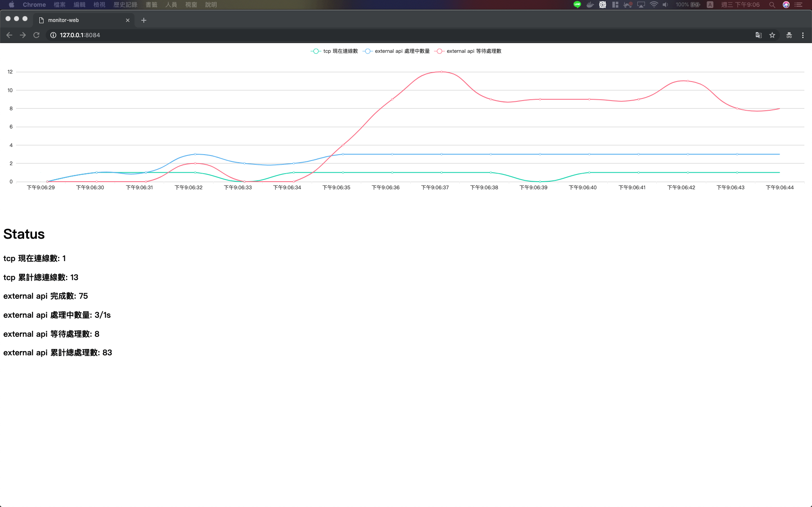

# golang-proxy-server

> a tcp server can request external api 

## Set Config

please copy server config file(`./config/config.yaml`) to (`/etc/golang-proxy-server/config.yaml`):

```yaml
env: 
    # tcp server ip
    env_host: 127.0.0.1
    # tcp server port
    env_port: 8080
    # tcp server connect timeout(feature)
    env_timeout: 3
external:
    # external api url, if external_url == mock , it will response mock data
    external_url: "http://127.0.0.1:8083/posts"
    # external api method(support POST/GET)
    external_method: POST
    # external api request limit per
    external_limit_per: 3
    # external api request timeout
    external_request_timeout: 10
    # tcp server request to external api wait queue length
    external_request_queue: 2000
```

please use go:1.1 up, or install dependency by go.mod

## How to Use

use:

```
GO111MODULE=on go run main.go
```

connect server

```
nc localhost 8080
```

tcp server status(http rest-like api)

```
GET 127.0.0.1:8081/monitor
```

## docker-compose

config:

same as `./config/config.yaml`, but you can update it to change config when `docker-compose restart`, without `docker-compose build` again.

```
./docker/configure.conf
```

```
cd docker
sh update.sh

# or
docker-compose build
docker-compose up -d
```

connect server

```
nc localhost 8080
```

tcp server status(http rest-like api)

```
GET 127.0.0.1:8081/monitor
```

mock server(json-server)

```
web-monitor: http://127.0.0.1:8084
tcp connect: nc localhost 8080
```

Demo:

